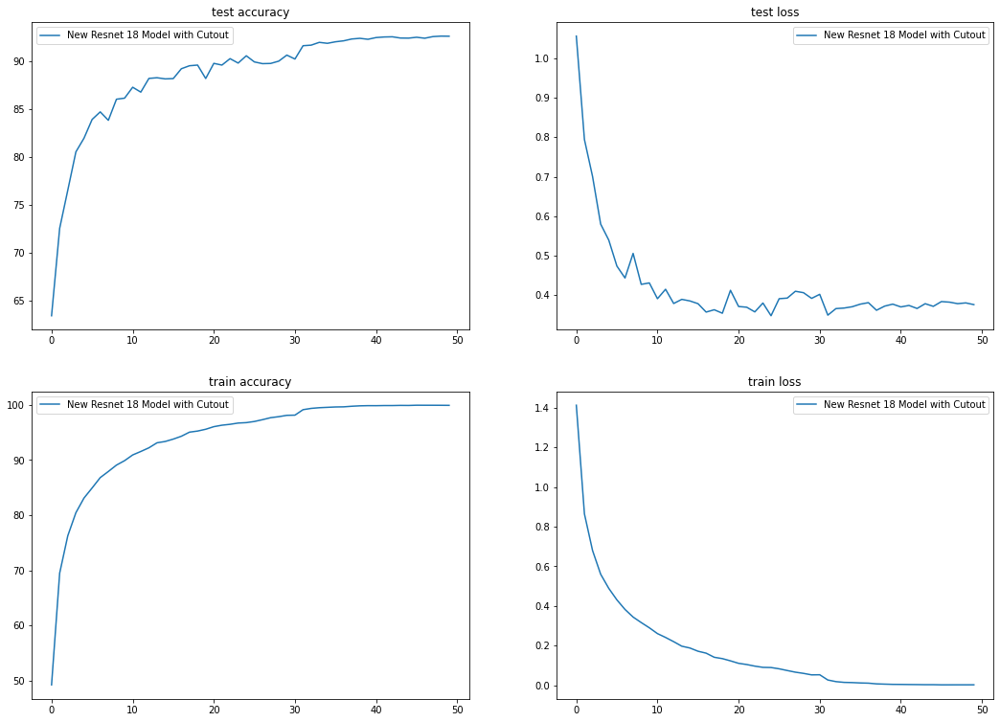
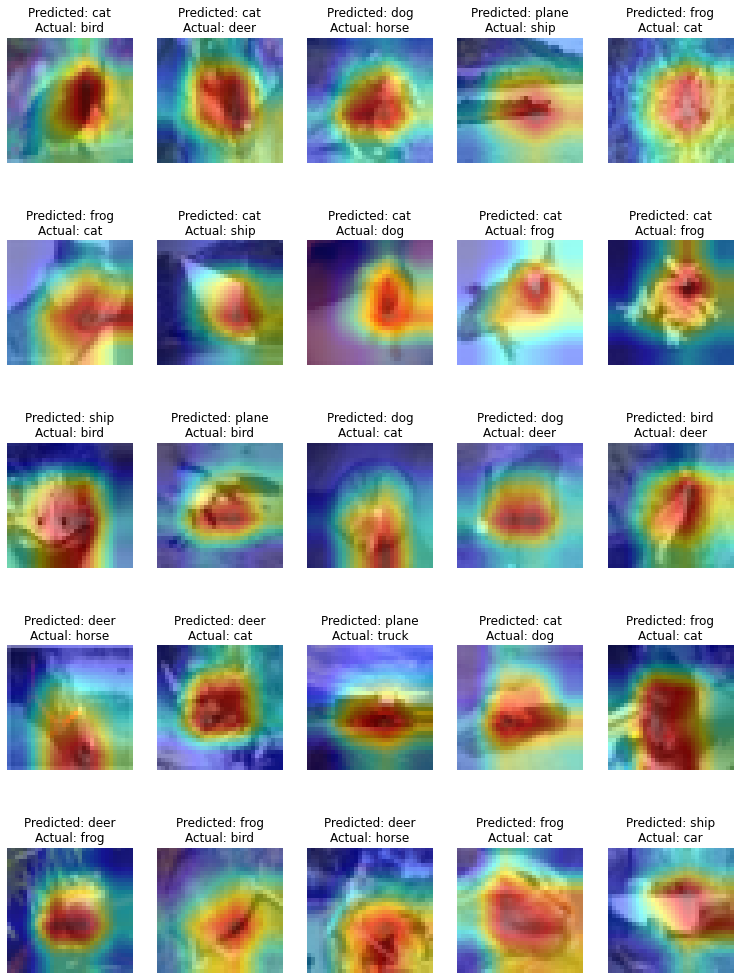

### Session-10 Assignment

Here we are training Cifar10 dataset with older model which we trained along with augmentations from Albumentations library and get atleast 88% accuracy under 50 epochs. 

The package used here is developed by part of our team [Athena](https://github.com/firekind/athena). 

Here while training i used augmentations like **Horizantal Flip with 50% probability, and Randomcrop**. For this assignment we implemented LRFinder to get the optimal learning rate from the data we have.

### Training

1. I have trained around for 50 epochs.
2. Used **ReducedLRonPlateau & SGD** optimizer with momentum. 
3. Tried l1 weight decay loss, but didn't got good result. Currently used classical cross entropy loss.
4. Highest **Test Accuracy** achieved is 92.61% in 49 Epoch.
5. From the model training, i thought the **model would have improved further** with more epochs. 

Epoch: 49 / 50
782/782 [==============================] - 60s 77ms/step - train loss: 0.0030 - train accuracy: 99.9360
Test set: Average loss: 0.3801, **Accuracy: 9261/10000 (92.61%)**

#### Training & testing plots

### GradCam

Later i ran GradCam on 25 misclassified images & plotted heatmap on them.

