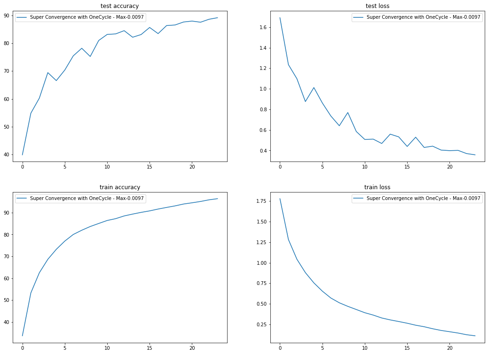
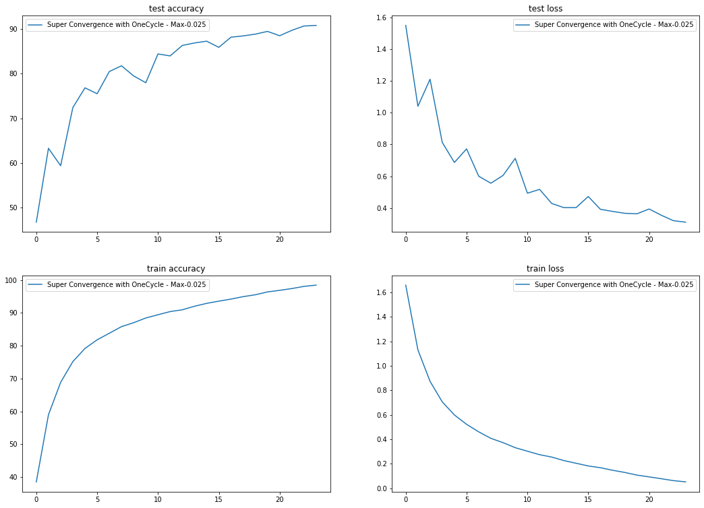

### Session-11 Assignment

Here we are training on Cifar10 dataset for achieving some interesting things like Super Convergence with One Cycle Policy. 

The package used here is developed by part of our team [Athena](https://github.com/firekind/athena). 

Here we are advised to use augmentations like **Randomcrop ** after padding to get different views of the same image followed by Horizantal Flip and cutout. For this assignment we implemented One Cycle Policy to train the network efficiently in less iterations.

### Training

1. Here first i did use LRFinder to do range_test with linearly increasing LR and plotted it against accuracy. 
2. From the plot i tried analyzing the Learning rates where the accuracy is increasing. 
3. I came up with **certain threshold where i think model has seen improvement** compared to previous learning rates. 
4. So I experimented with that Learning rates with **One Cycle Policy** along with division factor of 8. 
5. From the LR & Accuracy plot, i thought  0.007 to 0.01 is good range, so i experimented with these values. 
6. First i went with 0.008 and got max 88.64 & with 0.009 it increased to 88.9 and dropped to 88 again with 0.007. So i caught a trend & increased. 
7. Highest i was able to achieve is **90.79%** in Max_Lr = 0.025

Epoch: 24 / 24 98/98 [==============================] - 63s 648ms/step - train loss: 0.0513 - train accuracy: 98.4560 Test set: Average loss: 0.3105, **Accuracy: 9079/10000 (90.79%)**

#### Training & testing plots

Here is the Train & Test Accuracy & loss plots for one Experiment with OneCycle - Max-0.0097

Here is the Train & Test Accuracy & loss plots for one Experiment with OneCycle - Max-0.025

