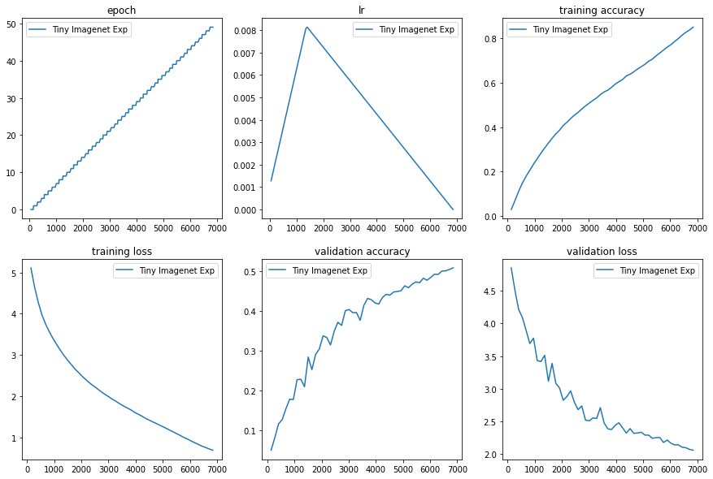
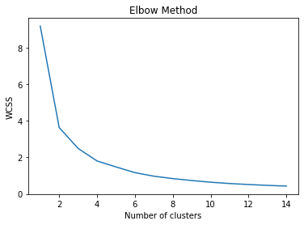

### Session-12 Assignment

Here we are training on Tiny Imagenet dataset with Resnet18 architecture. 

The package used here is developed by part of our team [Athena](https://github.com/firekind/athena). 

Along with this we have to collect certain images of people with hardhat, vests, masks & boots & annotate using VGG Image annotator and do **k-means clustering on there bounding box aspect ratios**.

### Training

1. First i split the dataset in to 70-30 as suggetsed.
2. I did use LRFinder to do range_test with linearly increasing LR for 100 iterations and plotted it against loss. 
3. From the plot i tried analyzing the Learning rates where the i have steepest gradient with respect to loss. 
4. I used that as a max LR and increased for 10 epochs and brought it down and did linear annealing.
5. So I experimented with that Learning rates with **One Cycle Policy**.
6. Highest i was able to achieve is **50.87%**. 

Epoch: 50 / 50 137/137 [==============================] - 140s 1s/step - loss: 0.6850 - train accuracy: 0.8489 Validation set: validation loss: 2.0554, **validation accuracy: 0.5087**

#### Training & testing plots

Here is the Train & Test Accuracy & loss plots for one Experiment.

## Elbow Method to determine number of clusters

### Explaining the Json file

Json is like dictionary or dataframe in Python. It contains key-value pairs. 

1)First it has file id, it is combination of filename & size.

2) Inside File id, you'll contain filename, as the name suggests that is the name of image, next is size of image in bytes.

3) Inside File id another important column is regions, which has two sub categories shape_attributes & region attributes. 

4) region attributes has class_names of the object & shape_attributes has location of the object with width, height & its coordinates. 

5) Only thing changes if you have multiple instances of same class or multiple objects in a single images is that you have multiple region attributes consisting of multiple object & shape attributes with there details. 

