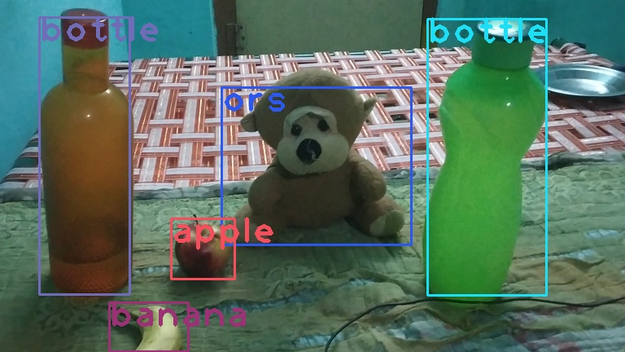

### Session-13 Assignment

#### There are 2 Tasks in this Assignment

#### First Task
Using YoloV3 weights trained on COCO dataset, by using only OpenCV we did inference on some sample Images. We followed this [source] (https://pysource.com/2019/06/27/yolo-object-detection-using-opencv-with-python/)

You can find the infer images here.

#### Second Task

Training YoloV3 Algorithm on custom dataset, here the classes are PPE equipment (Hardhat, Vest, Mask & Boots).

Annotations is done with this tool [YoloV3 Annotation tool] (https://github.com/miki998/YoloV3_Annotation_Tool) and followed this repo for training [YoloV3 - School of AI] (https://github.com/theschoolofai/YoloV3).

Following the above repo, i created the custom data in such a way so that our architecture will fit.

##### Training
While training, tried **progressive resizing. Initially trained on image sizes of 256 with batch size of 64 & later fine tuned on imgae sizes of 512** with 16 batch size. Hopefully this helped in detecting small objects also.

Used FFMPEG to convert video to images & detected using my model & converted back to video using the same FFMPEG.

You can find the output video [here] (https://youtu.be/34fO3nmSzlI) 

