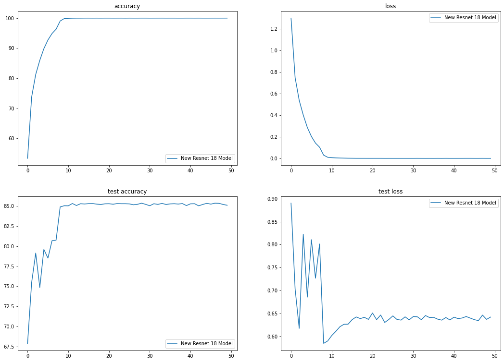

### Session-8 Assignment

Here we are training Cifar10 dataset with Resnet-18 model and get atleast 85% accuracy. 

The package used here is developed by part of our team [Athena](https://github.com/firekind/athena). 

### Training

1. I have trained around for 50 epochs.
2. Used Step Learning rate & SGD optimizer with momentum. 
3. Tried l1 loss, but didn't got good result. 
4. Highest accuracy achieved is 85.36 in epoch 47.

**Epoch: 47 / 50** 782/782 [==============================] - 67s 86ms/step - loss: 0.0024 - accuracy: 99.9980 Test set: Average loss: 0.6341, **Accuracy: 8536/10000 (85.36%)**

#### Training & testing plots

#### Things to do to improve:

1. Training for longer epochs with Data Augmentation will surely help the model.